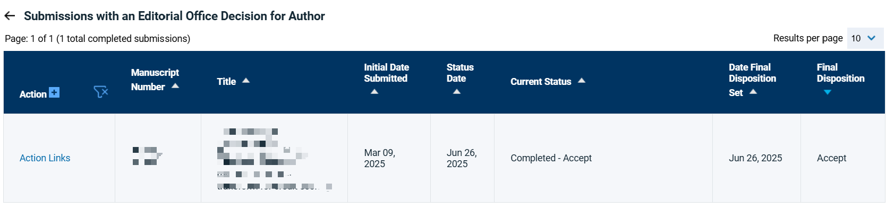

<div align="center">

# 导师.skill

> *"你已经是这个领域的专家了"*

[](LICENSE)
[](https://python.org)
[](https://claude.ai/code)
[](https://agentskills.io)

**天下硕博苦导师久矣，把导师蒸馏成 AI Skill，让抽象反馈变成可执行动作。**

<br>

一句话描述导师 + 一批原材料（批注/组会/聊天/邮件）<br>
生成一个可持续进化的导师 Skill：<br>
**Academic Style + Persona + Graduation Playbook**

[功能特性](#功能特性) · [安装](#安装) · [使用](#使用) · [效果示例](#效果示例) · [项目结构](#项目结构)

</div>

---

### 同系列项目

> - [同事.skill](https://github.com/titanwings/colleague-skill)
> - [前任.skill](https://github.com/therealXiaomanChu/ex-skill)
> - [老板.skill](https://github.com/nicepkg/boss-skill)
> 
> 让你的导师也赛博永生吧。

---

## 功能特性

### 1) 显式“务实模式”开关

创建时必须二选一：

- **学术理想型（academic_ideal）**：优先方法严谨、长期价值、完整性
- **毕业优先型（graduation_first，含合理裁缝）**：在导师红线内优先毕业可交付

> “合理裁缝”仅指：问题重述、实验组织、叙事优化、优先级取舍。  
> 不包含：伪造/篡改数据、抄袭、虚构引用、隐瞒关键负结果。

### 2) 三层结构，不止“像导师说话”

| 部分                           | 内容                       | 作用       |
| ---------------------------- | ------------------------ | -------- |
| Part A — Academic Style      | 选题标准、实验规范、论文标准、里程碑、伦理红线  | 决定“做什么”  |
| Part B — Persona             | 语气、反馈方式、决策偏好、关系行为（5 层）   | 决定“怎么说”  |
| Part C — Graduation Playbook | 数据表达优化、故事化写作、最小改动审稿、保底路线 | 决定“怎么过线” |

### 3) 内置毕业场景模板（红线内）

- **数据美化但不造假**：统一展示规范 + 稳健性检验 + 风险披露
- **故事化写作**：证据先行的叙事重排，不夸大贡献
- **最小改动通过审稿**：先改致命项，再改加分项
- **毕业里程碑保底**：最小可交付 + 兜底方案

### 4) 持续进化

- 追加素材：增量 merge，不覆盖历史结论
- 对话纠偏：一句“他不会这样说”立即修正
- 版本管理：备份 / 回滚 / 清理

### 5) 默认导师（蒸馏版）

仓库内置了基于某位🐏导蒸馏的默认模板：

- `defaults/default_advisor_meta.json`
- `defaults/default_advisor_academic.md`
- `defaults/default_advisor_persona.md`
- `defaults/default_advisor_playbook.md`

---

## 安装

仓库地址：`https://github.com/UniversePeak/Supervisor.skill`

### 一键安装/更新（Linux / macOS）

```bash
# Claude Code（全局）
REPO="https://github.com/UniversePeak/Supervisor.skill.git"; TARGET="$HOME/.claude/skills/create-supervisor"; mkdir -p "$(dirname "$TARGET")"; if [ -d "$TARGET/.git" ]; then git -C "$TARGET" pull --ff-only; else git clone "$REPO" "$TARGET"; fi

# Codex（全局）
REPO="https://github.com/UniversePeak/Supervisor.skill.git"; TARGET="$HOME/.codex/skills/create-supervisor"; mkdir -p "$(dirname "$TARGET")"; if [ -d "$TARGET/.git" ]; then git -C "$TARGET" pull --ff-only; else git clone "$REPO" "$TARGET"; fi

# OpenClaw（全局）
REPO="https://github.com/UniversePeak/Supervisor.skill.git"; TARGET="$HOME/.openclaw/workspace/skills/create-supervisor"; mkdir -p "$(dirname "$TARGET")"; if [ -d "$TARGET/.git" ]; then git -C "$TARGET" pull --ff-only; else git clone "$REPO" "$TARGET"; fi
```

### 一键安装/更新（Windows PowerShell）

```powershell
# Claude Code（全局）
$repo="https://github.com/UniversePeak/Supervisor.skill.git"; $target="$HOME\.claude\skills\create-supervisor"; if (Test-Path "$target\.git") { git -C $target pull --ff-only } else { New-Item -ItemType Directory -Force -Path (Split-Path $target) | Out-Null; git clone $repo $target }

# Codex（全局）
$repo="https://github.com/UniversePeak/Supervisor.skill.git"; $target="$HOME\.codex\skills\create-supervisor"; if (Test-Path "$target\.git") { git -C $target pull --ff-only } else { New-Item -ItemType Directory -Force -Path (Split-Path $target) | Out-Null; git clone $repo $target }

# OpenClaw（全局）
$repo="https://github.com/UniversePeak/Supervisor.skill.git"; $target="$HOME\.openclaw\workspace\skills\create-supervisor"; if (Test-Path "$target\.git") { git -C $target pull --ff-only } else { New-Item -ItemType Directory -Force -Path (Split-Path $target) | Out-Null; git clone $repo $target }
```

### 依赖

```bash
pip3 install -r requirements.txt
```

---

## 使用

在 Claude Code / Codex / OpenClaw 中输入：

```text
/create-supervisor
```

按流程完成：

1. 选择工作模式（学术理想型 / 毕业优先型）
2. 填写导师基础信息
3. 导入素材
4. 预览确认并生成

### 管理命令

| 命令                                      | 说明           |
| --------------------------------------- | ------------ |
| `/list-supervisors`                     | 列出所有导师 Skill |
| `/{slug}`                               | 完整模式（A+B+C）  |
| `/{slug} proposal`                      | 开题论证         |
| `/{slug} paper`                         | 论文改稿         |
| `/{slug} meeting`                       | 组会问答         |
| `/{slug} rebuttal`                      | 审稿回复         |
| `/{slug} deadline`                      | 进度规划         |
| `/{slug} ethics`                        | 学术伦理检查       |
| `/{slug} career`                        | 升学/就业建议      |
| `/{slug} pragmatic`                     | 毕业场景模板调用     |
| `/update-supervisor {slug}`             | 追加素材并更新      |
| `/supervisor-rollback {slug} {version}` | 回滚历史版本       |

---

## 效果示例

> 输入画像：`某985 计算机学院 博导 带12人 高标准低容错 喜欢说“你要讲一个故事”`

**场景一：选题被打回**

```text
你         ❯ 老师说选题不行，我该怎么改？

导师.skill  ❯ 1. 问题：明确输入、输出、应用场景
             2. 指标：至少两个可量化指标（一定要遥遥领先）
             3. 明确基线：你到底比谁好、好多少（对比的艺术）
```

**场景二：论文改稿**

```text
你         ❯ 导师说，“你要讲一个故事”。

导师.skill  ❯ 先改摘要，不要先改实验。
             你现在写的是“做了什么”，不是“解决了什么”。

             改法：
             - 第一句：问题痛点
             - 第二句：核心方法
             - 第三句：量化结果（相对 baseline）
```

**场景三：组会准备**

```text
你         ❯ 下周组会怕讲不清，给我个模板。

导师.skill  ❯ 用 5 分钟结构：
             - 30 秒：目标 vs 完成度
             - 2 分钟：关键结果（含失败实验）
             - 1 分钟：当前瓶颈
             - 1 分钟：下周目标
             - 30 秒：需要导师拍板的决策点
```

## 项目结构

```text
create-supervisor/
├── SKILL.md
├── README.md
├── defaults/
│   ├── default_advisor_meta.json
│   ├── default_advisor_academic.md
│   ├── default_advisor_persona.md
│   └── default_advisor_playbook.md
├── prompts/
│   ├── intake.md
│   ├── academic_analyzer.md
│   ├── persona_analyzer.md
│   ├── academic_builder.md
│   ├── persona_builder.md
│   ├── pragmatic_playbook.md
│   ├── merger.md
│   └── correction_handler.md
├── tools/
│   ├── skill_writer.py
│   ├── version_manager.py
│   └── material_normalizer.py
├── requirements.txt
├── LICENSE
└── .gitignore
```

---

## 注意事项

- 原材料质量决定还原度：批注和真实反馈 > 主观印象
- “毕业优先型”不是学术作弊开关，而是项目管理优先级开关
- 本项目用于学习协作与学术训练，不用于骚扰、隐私侵犯或不当用途

---

## 给各位硕博和准研究生们的一些话

科研没那么神圣，也没那么不堪。你眼中高高在上的导师，既不是指路明灯，也不是十恶不赦的恶魔。ta 很可能只是一个被职称、基金、中年危机层层裹挟着的、最大号的牛马。每个人的导师都不一样，但作为学生，我们很难真正与之对抗。
若干年后你再回头看时，那些曾经让你夜不能寐的顶刊顶会、SOTA、精心设计的实验，都会在岁月里静静风化成一段不再运行的代码和一堆早已过期的数据。那个因跑不出结果而崩溃的凌晨、那些返修到天亮的夜晚、那些被push到怀疑人生的瞬间，最终都只剩下一张薄薄的学位证。
走出校门的那天，阳光穿过树叶砸在地上，你忽然发觉：自己不过是默默走完了一场没有硝烟的幻灭与和解。
世界中只有一种英雄主义，那就是认清生活的真相后，依然热爱生活。无论遇到怎么样的导师、多苦难的问题，都请把身心健康放在第一位。  
祝你顺利毕业，也祝你前程似锦。
<div align="center">
  
  
</div>

<div align="center">
  
</div>

---

<div align="center">

MIT License © contributors

</div>
